### Mixed degradation results (Gaussian σ=25 + 50% mask)

**Kodak24 (Row 1)**

  
  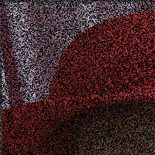
  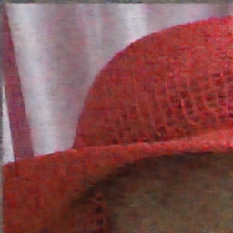
  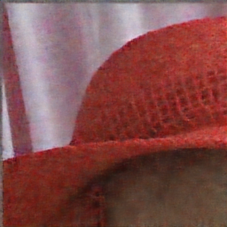
  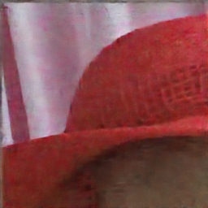
  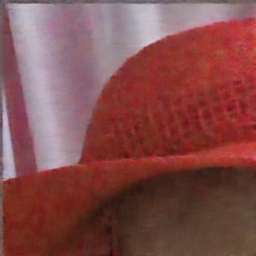

(b) Degradation (10.27 / 0.073) (c) Dense (27.86 / 0.693)  
(d) SHIELD-P (28.56 / 0.697) (e) SHIELD-R (28.15 / 0.697) (f) SHIELD-PR (28.65 / 0.715)

---

**Tampere17 (Row 2)**

  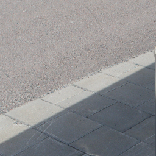
  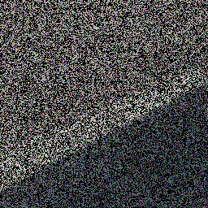
  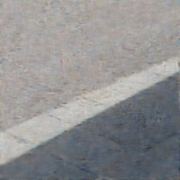
  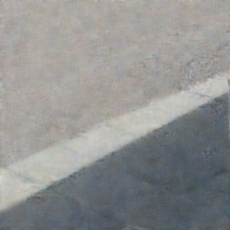
  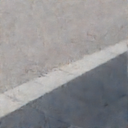
  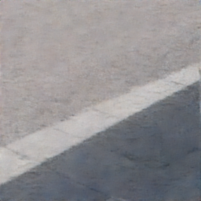

(a) GT (∞ / 1) (b) Degradation (7.59 / 0.021) (c) Dense (29.45 / 0.607)  
(d) SHIELD-P (29.88 / 0.631) (e) SHIELD-R (30.07 / 0.641) (f) SHIELD-PR (30.23 / 0.643)
### Inpainting results (PSNR / SSIM)Inpainting results (PSNR/SSIM) with 50\% random masking on datasets Kodak24 (first row) and Tampere17 (second row). From left to right: ground truth, masked input, Dense Noise2Noise, SHIELD-P, SHIELD-R, and SHIELD-PR.
