<table style="border:none;">
  <tr>
    <td align="center" style="border:none;">
      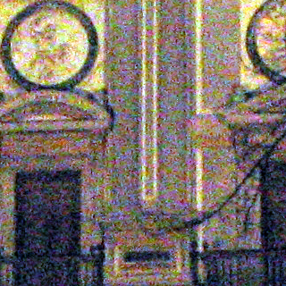 
      (a) Real3-Noisy
    </td>
    <td align="center" style="border:none;">
      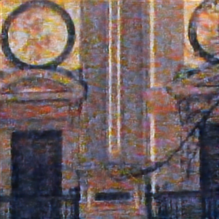 
      (b) Dense
    </td>
    <td align="center" style="border:none;">
      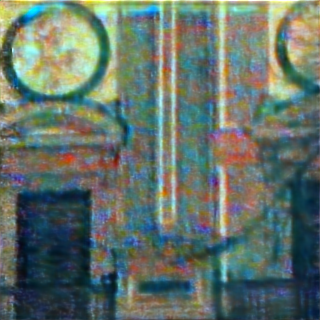 
      (c) SHIELD-P
    </td>
    <td align="center" style="border:none;">
      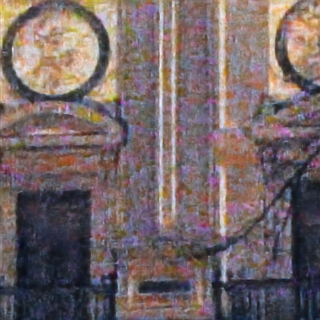 
      (d) SHIELD-R
    </td>
    <td align="center" style="border:none;">
      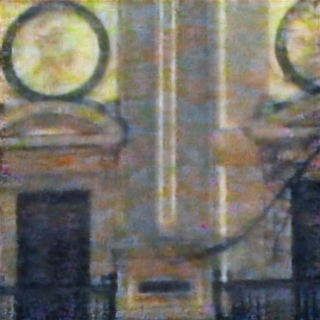 
      (e) SHIELD-PR
    </td>
  </tr>

  <tr>
    <td align="center" style="border:none;">
      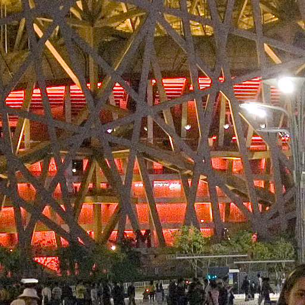 
      (a) Real9-Noisy
    </td>
    <td align="center" style="border:none;">
      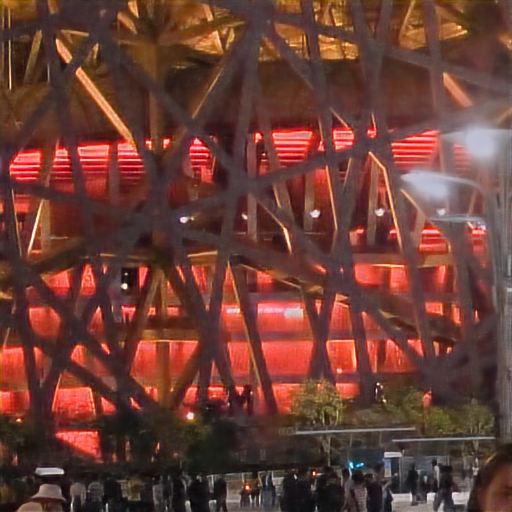 
      (b) Dense
    </td>
    <td align="center" style="border:none;">
      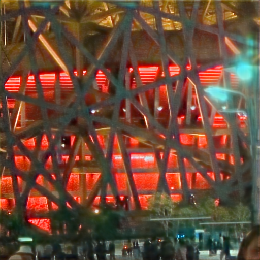 
      (c) SHIELD-P
    </td>
    <td align="center" style="border:none;">
      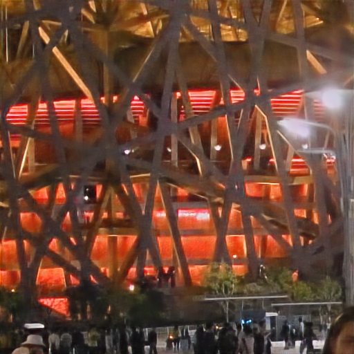 
      (d) SHIELD-R
    </td>
    <td align="center" style="border:none;">
      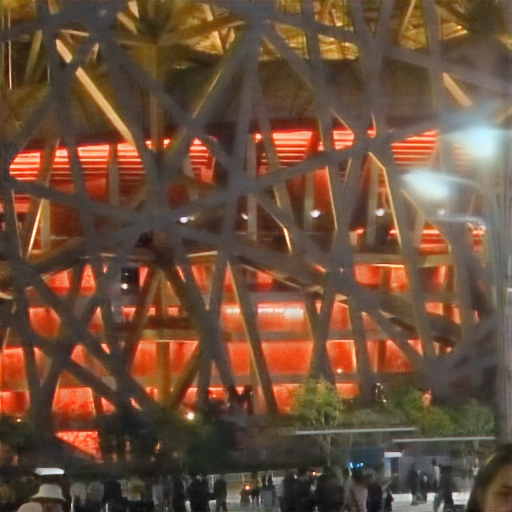 
      (e) SHIELD-PR
    </td>
  </tr>
</table>

### Figure A. Visual comparisons on real-world noisy images. (a) Input images, followed by results from (b) Dense N2N, (c) SHIELD-P, (d) SHIELD-R, and (e) SHIELD-PR.

<table style="border:none;">

  <!-- Row 1 -->
  <tr>
    <td align="center" style="border:none;">
       
      (a) Kodak24 ∞ / 1
    </td>
    <td align="center" style="border:none;">
      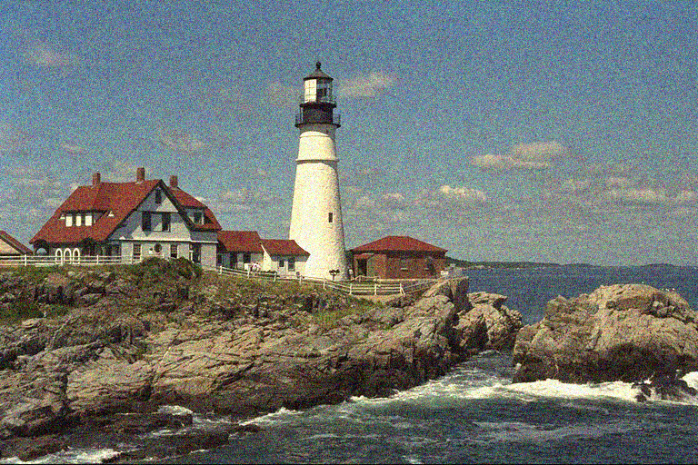 
      (b) Noisy 20.26 / 0.353
    </td>
    <td align="center" style="border:none;">
      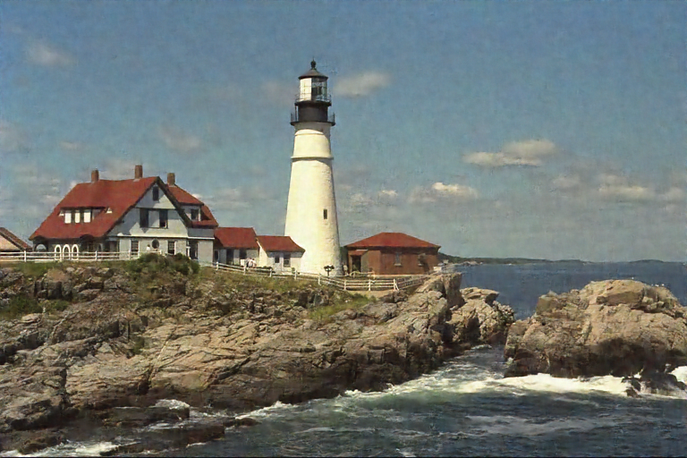 
      (c) N2N 30.28 / 0.860
    </td>
    <td align="center" style="border:none;">
       
      (d) AP-BSN 25.03 / 0.701
    </td>
    <td align="center" style="border:none;">
       
      (e) PUCA 24.67 / 0.690
    </td>
    <td align="center" style="border:none;">
       
      (f) UGoDIT 27.82 / 0.774
    </td>
    <td align="center" style="border:none;">
       
      (g) SITCOM 26.09 / 0.764
    </td>
    <td align="center" style="border:none;">
      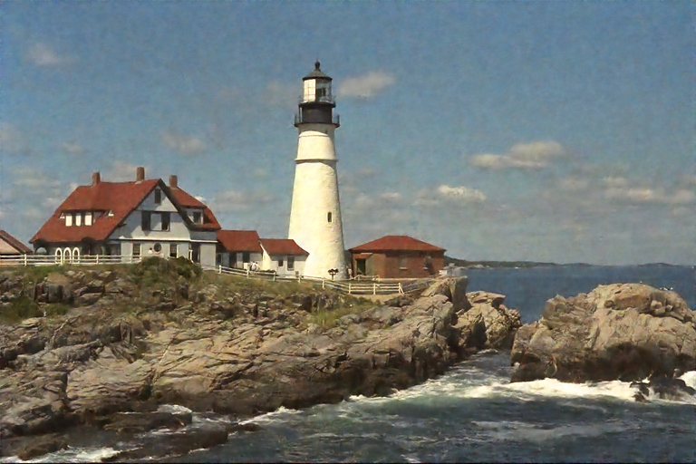 
      (h) SHIELD-PR 32.29 / 0.864
    </td>
  </tr>

  <tr>
    <td align="center" style="border:none;">
       
      (a) Set14 ∞ / 1
    </td>
    <td align="center" style="border:none;">
       
      (b) Noisy 20.58 / 0.441
    </td>
    <td align="center" style="border:none;">
       
      (c) N2N 23.32 / 0.685
    </td>
    <td align="center" style="border:none;">
       
      (d) AP-BSN 22.53 / 0.672
    </td>
    <td align="center" style="border:none;">
       
      (e) PUCA 23.36 / 0.664
    </td>
    <td align="center" style="border:none;">
       
      (f) UGoDIT 23.94 / 0.631
    </td>
    <td align="center" style="border:none;">
       
      (g) SITCOM 24.52 / 0.707
    </td>
    <td align="center" style="border:none;">
       
      (h) SHIELD-PR 27.77 / 0.813
    </td>
  </tr>

</table>

### Figure B. Denoising results (PSNR/SSIM) for Gaussian noise with $\sigma$ = 25 on Kodak24 (first row) and Set14 (second row). (a) ground truth, (b) noise input, and the denoising results (c) Noise2Noise, (d) AP-BSN, (e) PUCA, (f) UGoDIT, (g) SITCOM, and (h) our SHIELD-PR (N2N). 

<table style="border:none;">
  <!-- Row 2 -->
  <tr>
    <td align="center" style="border:none;">
      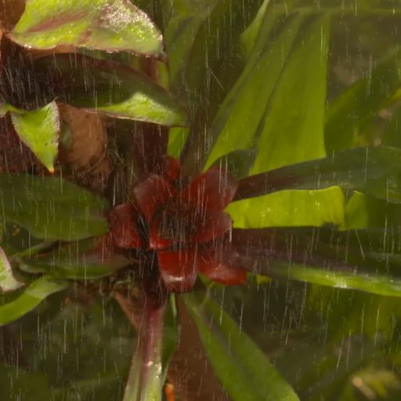 
      (a) Rainy 5.2628 / 5.4148
    </td>
    <td align="center" style="border:none;">
       
      (b) N2V 6.6050 / 5.5473
    </td>
    <td align="center" style="border:none;">
      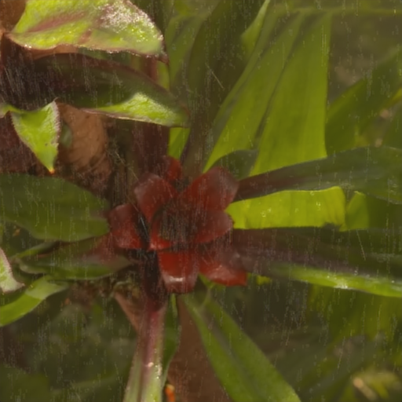 
      (c) R2A 4.2619 / 5.0264
    </td>
    <td align="center" style="border:none;">
      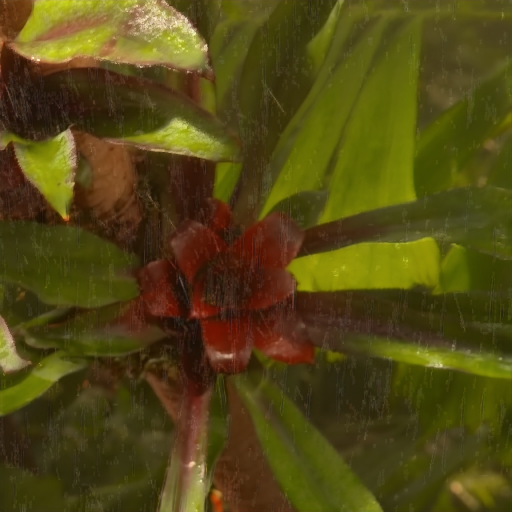 
      (d) SHIELD-PR 4.0698 / 4.7136
    </td>
  </tr>
  <!-- Row 4 -->
  <tr>
    <td align="center" style="border:none;">
      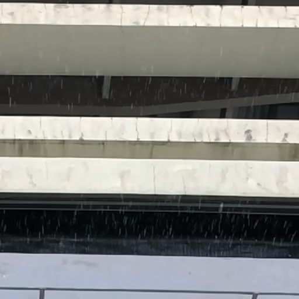 
      (a) Rainy 7.6977 / 6.8713
    </td>
    <td align="center" style="border:none;">
      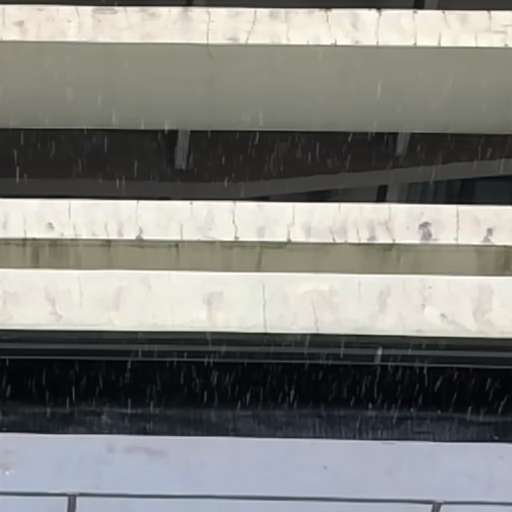 
      (b) N2V 8.3387 / 7.0712
    </td>
    <td align="center" style="border:none;">
      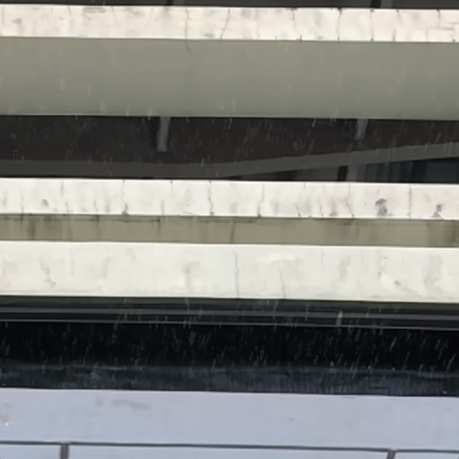 
      (c) R2A 6.9029 / 6.6334
    </td>
    <td align="center" style="border:none;">
      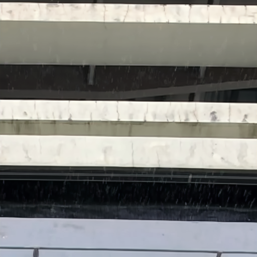 
      (d) SHIELD-PR 6.5475 / 6.3197
    </td>
  </tr>

</table>

### Figure C. Visual comparison on real-data image deraining (NIQE$\downarrow$/PI$\downarrow$). From left to right: (a) Rainy Input, (b) Noise2Void, (c) Rain2Avoid, and (d) SHIELD-PR. 

<table style="border:none;">
  <tr>
    <td align="center" style="border:none;">
       
      (a) Kodak ∞ / 1
    </td>
    <td align="center" style="border:none;">
      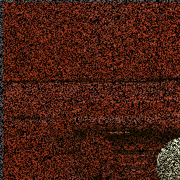 
      (b) Degradation 11.49 / 0.136
    </td>
    <td align="center" style="border:none;">
      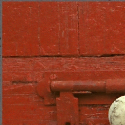 
      (c) Dense 31.78 / 0.837
    </td>
    <td align="center" style="border:none;">
      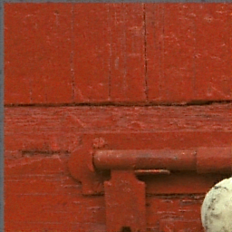 
      (d) SHIELD-P 31.76 / 0.837
    </td>
    <td align="center" style="border:none;">
       
      (e) SHIELD-R 31.52 / 0.820
    </td>
    <td align="center" style="border:none;">
      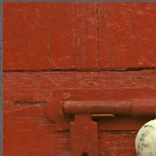 
      (f) SHIELD-PR 32.08 / 0.838
    </td>
  </tr>

  <tr>
    <td align="center" style="border:none;">
       
      (a) Tampere17 ∞ / 1
    </td>
    <td align="center" style="border:none;">
      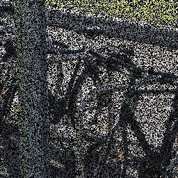 
      (b) Degradation 7.96 / 0.140
    </td>
    <td align="center" style="border:none;">
       
      (c) Dense 26.31 / 0.898
    </td>
    <td align="center" style="border:none;">
       
      (d) SHIELD-P 26.72 / 0.904
    </td>
    <td align="center" style="border:none;">
       
      (e) SHIELD-R 27.05 / 0.900
    </td>
    <td align="center" style="border:none;">
       
      (f) SHIELD-PR 27.17 / 0.901
    </td>
  </tr>
</table>

### Figure D. Inpainting results (PSNR/SSIM) with 50\% random masking on datasets Kodak24 (first row) and Tampere17 (second row). From left to right: ground truth, masked input, Dense Noise2Noise, SHIELD-P, SHIELD-R, and SHIELD-PR.

<table style="border:none;">
  <tr>
    <td align="center" style="border:none;">
       
      (a) Kodak ∞ / 1
    </td>
    <td align="center" style="border:none;">
       
      (b) Degradation 10.27 / 0.073
    </td>
    <td align="center" style="border:none;">
       
      (c) Dense 27.86 / 0.693
    </td>
    <td align="center" style="border:none;">
       
      (d) SHIELD-P 28.56 / 0.697
    </td>
    <td align="center" style="border:none;">
       
      (e) SHIELD-R 28.15 / 0.697
    </td>
    <td align="center" style="border:none;">
       
      (f) SHIELD-PR 28.65 / 0.715
    </td>
  </tr>

  <tr>
    <td align="center" style="border:none;">
       
      (a) Tampere17 ∞ / 1
    </td>
    <td align="center" style="border:none;">
       
      (b) Degradation 7.59 / 0.021
    </td>
    <td align="center" style="border:none;">
       
      (c) Dense 29.45 / 0.607
    </td>
    <td align="center" style="border:none;">
       
      (d) SHIELD-P 29.88 / 0.631
    </td>
    <td align="center" style="border:none;">
       
      (e) SHIELD-R 30.07 / 0.641
    </td>
    <td align="center" style="border:none;">
       
      (f) SHIELD-PR 30.23 / 0.643
    </td>
  </tr>
</table>

### Figure E. Mixed Degradation (Gaussian noise ($\sigma$ = 25) with 50\% random masking ) results (PSNR/SSIM) on datasets Kodak24 (first row) and Tampere17 (second row). From left to right: ground truth, masked input, Dense Noise2Noise, SHIELD-P, SHIELD-R, and SHIELD-PR.

<table style="border:none;">

  <!-- Row 1: Kodak24 -->
  <tr>
    <td align="center" style="border:none;">
       
      (a) Kodak24 ∞ / 1
    </td>
    <td align="center" style="border:none;">
      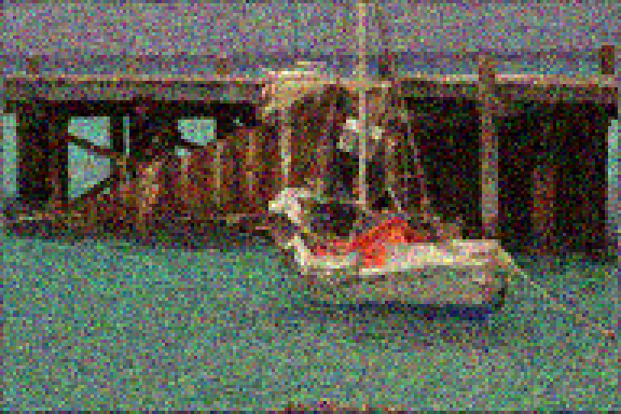 
      (b) Degradation 18.89 / 0.352
    </td>
    <td align="center" style="border:none;">
       
      (c) Dense 25.11 / 0.626
    </td>
    <td align="center" style="border:none;">
      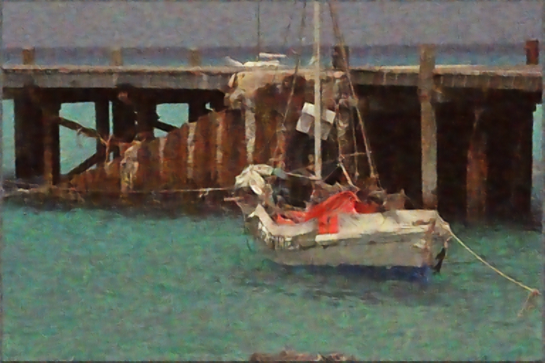 
      (d) SHIELD-P 25.35 / 0.646
    </td>
    <td align="center" style="border:none;">
       
      (e) SHIELD-R 25.34 / 0.645
    </td>
    <td align="center" style="border:none;">
       
      (f) SHIELD-PR 27.30 / 0.702
    </td>
  </tr>
  <!-- Row 2: Tampere17 -->
  <tr>
    <td align="center" style="border:none;">
      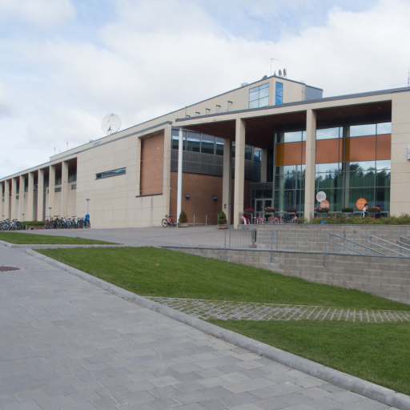 
      (a) Tampere17 ∞ / 1
    </td>
    <td align="center" style="border:none;">
       
      (b) Degradation 21.74 / 0.429
    </td>
    <td align="center" style="border:none;">
      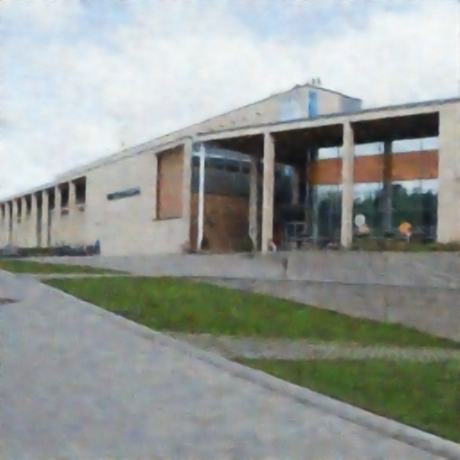 
      (c) Dense 27.71 / 0.772
    </td>
    <td align="center" style="border:none;">
       
      (d) SHIELD-P 28.04 / 0.801
    </td>
    <td align="center" style="border:none;">
      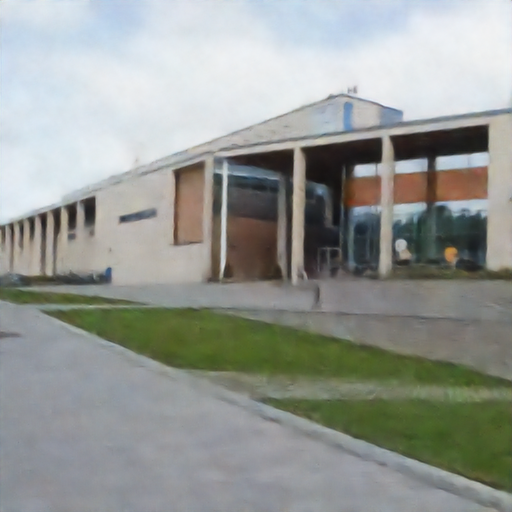 
      (e) SHIELD-R 27.84 / 0.781
    </td>
    <td align="center" style="border:none;">
       
      (f) SHIELD-PR 28.16 / 0.801
    </td>
  </tr>

</table>

### Figure F. Mixed degradation (Gaussian noise ($\sigma = 25$) with $2 \times$ bicubic downsampling) results (PSNR/SSIM) on datasets Kodak24 (top) and Tampere17 (bottom). From left to right: ground truth, degraded input, Dense Noise2Noise, SHIELD-P, SHIELD-R, and SHIELD-PR.

